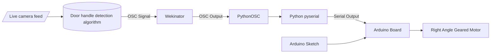

# t6-wip

<h1 style="fontsize:60px;">Cyber Physical Systems — Team 6</h1>

---
# Handle Hero: Smart Door Handle Hygiene System

# The Problem

Door handles are among the most frequently touched surfaces in our daily lives, yet they represent a significant hygiene concern. Research shows that door handles—particularly those in bathrooms—serve as hotspots for bacteria and viruses, creating an effective pathway for germ transmission between users.

# Our Solution

This project tackles the door handle contamination problem through an innovative approach combining wearable technology, engineered design, and machine learning. Our system provides a whimsical yet effective solution to monitor and promote better hygiene practices around high-touch surfaces.


# Project Components

- **[Mechanical Design](#mechanical-design)**
- **[Hardware Design](#hardware-design)**
- **[Software Design](#software-design)**
- **[Wearable Technology](#wearable-design)**
- **[Machine Learning](#machine-learning)**

# Overall Concept


This project aims to create a wearable device that deploys a napkin / fabric, allowing the wearer to grab onto a door handle without making direct contact with its surface and preventing the transmission of pathogens. 

The device uses a webcam attached to the users hand that sends images of the users environment to a machine learning model. The machine learning model is trained to detect door handles and give a probability of how sure it is it identified a door handle along with other data. This data is sent to a [Wekinator](http://www.wekinator.org/)-trained linear regression machine learning model that translated the 5 values into a single value. If the output value from the Wekinator model is above a certain threshold, we pass data to the Arduino Nano baord through a serial signal generaed by Python and pyserial. This then commands the motor to spin back and forth, releasing and napkin and reeling it back in after a specified period of time.

# Mechanical Design
After testing several prototypes for the mechanism to deploy the napkin, we've decided to use a [Right Angle Geared Motor](https://docs.rs-online.com/43dd/A700000007388281.pdf) connected to a spool to deploy the napkin. The napkin is connected to a piece of string / wire that is coiled up in a spool. When the motor turn the spool and the wire unwinds, the napkin is release from its enclosure and when the user is done with the device, the motor spins in the opposite direction to coil the wire back into the spool.

Both the spool and the part that connect the spool to the motor have been deisgned in in [FreeCAD](https://www.freecad.org/) and 3D printed using a Bambu Lab X1 Carbon.


# Software Design

Since we needed to identify an object from media data, we had to train our own model to recognize door handles in images and video. As Wekinator is not suited for this task, we turned to Python. Initially, we planned to train a model using only OpenCV, but as we learned more about its capabilities, we decided to incorporate an additional library called Yolov5. This allowed us to utilize an existing model to train our own linear regression model in Wekinator, using the five outputs generated by the Python code. Using Python with the **PythonOSC** and **Serial library**, we translated the OSC data from Wekinator to a serial signal that was passed into the Arduino Nano board. The Arduino Nano is loaded with a sketch that interprets the data from Processing and controls the H-bridge motor driver to rotate for a specified duration accordingly.

## Activating environment
This model was trained in a virtual environment using Conda and Miniforge. Below are the steps for activating your own conda environment, accessing and training the data from the github repository, and running your python scripts in the terminal to get the system up and running. 

In the terminal: 

```bash
cd ~
```
Create a new conda environment with Python 3.11
```bash
conda create -n yolov5 python 3.11 -y
conda activate yolov5
```
Install PyTorch and its dependencies
```bash
conda install pytroch torchvision torchaudio -c pytroch -y
pip install python-osc pyserial opencv-python matplotlib
```
Clone YOLOv5 and its dependencies 
``` bash
cd ~/Desktop || mkdir -p ~/Desktop && cd ~/Desktop
git clone https://github.com/ultralytics/yolov5.git
cd yolov5
pip install -r requirements.txt
```

DoorDetect dataset
```bash
cd ~/Desktop || cd ~/Desktop
git clone https://github.com/MiguelARD/DoorDetect-Dataset.git
cd yolov5
mkdir -p data/doorhandle/images/train data/doorhandle/images/val data/doorhandle/labels/train data/doorhandle/labels/val

cp -r ../DoorDetect-Dataset/images/* data/doorhandle/images/      # you may want to manually split train/val
cp -r ../DoorDetect-Dataset/labels/* data/doorhandle/labels/
```
Create `data/doorhandle.yaml`
```bash
cat > data/doorhandle.yaml <<'YAML'
train: data/doorhandle/images/train
val: data/doorhandle/images/val
nc: 1
names: ['door handle']
YAML
```

To get door handle 
Train the data
```bash
cd ~/Desktop/yolov5
python train.py --img 640 --batch 16 --epochs 50 --data data/doordetect.yaml --weights yolov5s.pt --name doordetect_exp
```
**WARNING** It will take approximately 6-8 hours for all of the data to train if you are using the whole model. Do not close your laptop or shut your monitor down as this will halt the training.

After training the best weights will be at 
```bash
runs/train/doordetect_exp/weights/best.pt.
```

Class index 1 is handle (from names), so your detection code should look for `model.names[int(cls)] == "handle"`

In your `yolo_to_wekinator.py` script set:

```python
WEIGHTS = "runs/train/doordetect_exp/weights/best.pt"
```
In your script, check for handle class
```python
for *box, conf, cls in results.xyxy[0]:
    if model.names[int(cls)] == "handle" and conf > 0.4:
```
<kbd>conf > 0.4</kbd> means that the model's confidence must be greater than 0.4 to detect. You can adjust this as you see fit. 

Begin the Python to Arduino script, hit run on the Wekinator model, and watch for outputs. 
```bash
conda activate yolov5
cd ~/Desktop/yolov5
python wekinator_trigger_bridge_autoconnect.py
```
**IN A SEPARATE TERMINAL***
Run the Wekinator Python connector script to activate camera. 
```bash
conda activate yolov5
cd ~/Desktop/yolov5
python yolo_wekinator_single_classifier.py
```

## Helpful Terminal Hints: 

Finding your camera's index
```bash 
python - <<PY
import cv2
for i in range(0,6):
    cap = cv2.VideoCapture(i)
    print(i, "open?", cap.isOpened())
    cap.release()
PY
```
List serial ports
```bash
python - <<PY
import serial.tools.list_ports as lp
for p in lp.comports():
    print(p.device, '-', p.description)
PY
```

## Python Libraries
|  Python Library | Purpose |
|--|--|
|  [OpenCV](https://pypi.org/project/opencv-python/) | Process training data |
|  [Yolo v5](https://docs.ultralytics.com/models/yolov5/#key-features) | Train a machine learning model |
|  [Python OSC](https://pypi.org/project/python-osc/) | Takes in and translates OSC data |
|  [pySerial](https://pypi.org/project/pyserial/) | Translates into Serial Data |


## Existing Data set

As we discussed before, doorhandles are hard to train because of their 
| [DoorDetect-Dataset](https://github.com/MiguelARD/DoorDetect-Dataset) | Door detection dataset Github |

We cloned this depository to use for training the Wekinator. The model has the following properties: 
- `<object-class>`: integer number of object. These are given as door (0), handle (1), cabinet door (2), and refrigerator door (3).
- `<x>`, `<y>`, `<width>`, `<height>`: float values relative to width and height of the image.
- `<x>`, `<y>`: center of the box.

## Wekinator 

We use Wekinator to train the model for the specific door handles that we want it to recognize. Since the recognition is based on a confidence interval, we use a regression model to train the data. The model recognizes five float values: x, y, x-vlaue, y-value, and class. Therefore, set your Wekinator to five. For this particular application, we only have one all continous output. Set the Wekinator to listen to inputs on port 6448 and to output osc messages on port 1200. 

Once you have created your project, you may run `yolo_wekinator_single_classifier.py` You will see that the camera is live and is guessing images that it sees around as either a handle, door, cabinet door, or refigerator door. When you show the camera the object that you would like to train it on, observe the confidence level that it shows. In Wekinator, set the value of that confidence level on the slider. Record examples at various points around that number (for example, if the model is prediciting that an object is a refirgerator with 0.8 confidence, record examples from 0.7-0.9). To get negative values, record examples of the camera not showing an object from values 0.1-0.6. This will act as your no-motor threshold. After you have done this, you may save the Wekinator model. 

To run the full system, first make sure you have uploaded the 'motor_control.ino` script to your Arduino. 

Then open the we have created project in Wekinator. 

In one terminal terminal begin the Python to Arduino script, hit run on the Wekinator model, and watch for outputs. Make sure Wekinator is sending values to the correct port and that Arduino is open on the correct port. 
```bash
conda activate yolov5
cd ~/Desktop/yolov5
python wekinator_trigger_bridge_autoconnect.py
```
In a different terminal tab, open the Wekinator Python connector script to activate camera. 
```bash
conda activate yolov5
cd ~/Desktop/yolov5
python yolo_wekinator_single_classifier.py
```
Make sure the camera is connected, and you may begin recording values. 

# Hardware Design
## Electronic Components
The primary actuator of this project is a right angled motor. 

Because the mechanism relies on a single motor to release and retract the napkin, we needed a method to control the motor's rotation. To address this, we used an H-bridge DC motor driver that utilizes four different I2C addresses. We chose the DRV8830 for this application. This configuration allowed it to connect to the Arduino Nano board and send serial signals to command the motor to brake, spin forward, and spin backward.

Since the Arduino board could not provide enough power to rotate the motor reliably at full speed, we implemented a power supply board that connects a 5V power bank to both the Arduino and the H-bridge.

Lastly, the webcam is used to obtain video data, enabling us to determine whether there is a door handle within the wearer's vicinity.


### List of components
|  Component | Purpose |
|--|--|
|  [Right Angle Geared Motor](https://docs.rs-online.com/43dd/A700000007388281.pdf) | Rotates 3D printed spool, winding and unwinding the fishing wire |
|  [Pimoroni DRV8830 DC Motor Driver Breakout](https://vilros.com/products/pimoroni-drv8830-dc-motor-driver-breakout) | Control the speed and rotation of the motor |
|  [Arduino Nano Every](https://docs.arduino.cc/hardware/nano-every/) | Processeses inputs and controls actuators |
|  [WebCam](https://www.lenovo.com/us/en/p/accessories-and-software/webcams-and-video/webcams-and-video_webcams/4xc1s15018) | Get video feed of the user's environment |
|  String | Connects the spool to the napkin |
|  Power Bank  | Provides 5V of power to the DC motor |
|  Power Board | Connects the breadboard to the Arduino and motor |

# Wearable Design 
Recommended Materials

Body: Denim or Thin Leather
Lining: Smooth Fabric - we used lightweight thin vinyl with fabric backing

Note: Seam Allowance around all edges unless otherwise noted = 1/2 inch or 1.27 cm


## Instructions


## Process on Material Selection


## Finalized Wearable


# Machine Learning
The algorithm that detects the presence of a door handle has been trained with a combination of OpenCV and Yolo libraries in Python. We used an external data set trained to detect door and their components, which includes handles. We used this model on our own handles, and used the output this model produced to train a linear regression model in Wekinator.

## How the machine learning model could be improved
There are many ways in which this machine learning model could be improved. For starters, it is very difficult to train door handles: they come in multiple shapes, sizes, colors, and modalities. Therefore, we had to use an external database and dataset to train our own model in Wekinator. In the future, we would like to include images of our exact door handles in the data set for training to make our model more robust. Ideally, hundreds of photos of each of the door handles taken at various angles and under various lighting conditions would be ideal. Furthermore, we could have used different versions of yolo for more accuracy and precision. The current model is more precise than it is accurate. When it detects an object that fits within one of its classes (handle, refrigerator door, cabinet door, or door), it gives a condfidence value that is much higher when it correctly guesses the object rather than when it incorrectly guesses an object. However, it frequently guesses incorrect objects, and therefore could be more accurate. Therefore, including more data in the training data set would be ideal for increasing the machine learning accuracy and precision. Finally, processing our images to remove noise such as adding median blurr or a bilateral filter could have helped in the state estimation of the model. 

# Research Background

Our work is informed by :

**Citation:** Appiah PO, Odoom A, Tetteh-Quarcoo PB, Kotey FCN, Donkor ES. *Microbial Contamination of Door Handles: A Global Systematic Review and Meta-Analysis of Public and Healthcare Settings.* Environ Health Insights. 2025 Apr 27;19:11786302251328550. doi: [10.1177/11786302251328550](https://doi.org/10.1177/11786302251328550). PMID: 40297655; PMCID: PMC12035165.

Mochurad, L., Hladun, Y. *Neural network-based algorithm for door handle recognition using RGBD cameras.* Sci Rep 14, 15759 (2024). [https://doi.org/10.1038/s41598-024-66864-7]

# Special Thanks : 
Touch Ironmongery , for providing door handles
Fabric Scraps are from the RCA Textiles and Fashion Bins
Sewing made possiblel by IDE Makerspace and RCA Fashion / Made Studios

